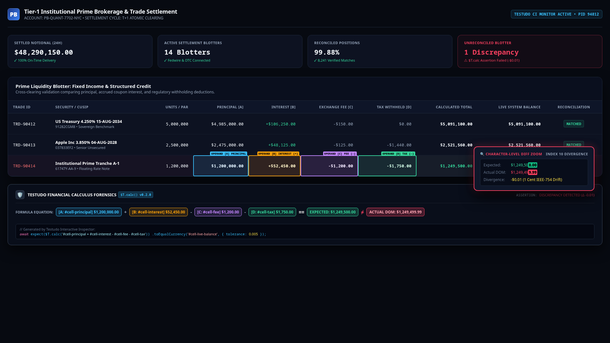
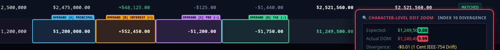
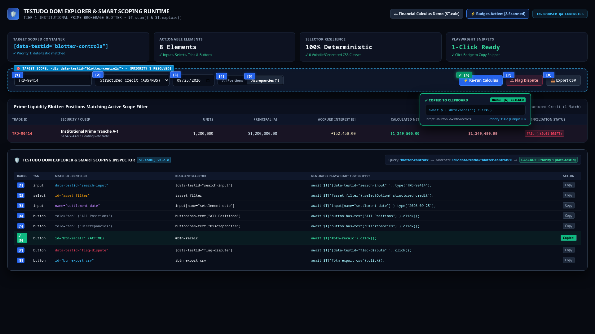
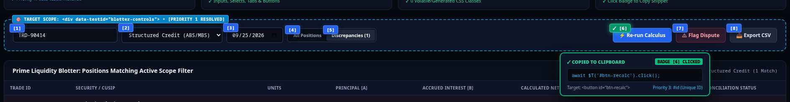

<div align="center">
  
  <h1>@aventine/testudo</h1>
  <p><strong>The Zero-Dependency Master of Test Suites</strong></p>
  <p>High-Precision Financial Math, Framework-Safe Typing, and In-Browser Visual Forensics for Playwright, Puppeteer, and Synthetic Monitors.</p>

  <p>
    <a href="https://github.com/aventine-labs/testudo/actions"></a>
    <a href="https://www.npmjs.com/package/@aventine/testudo"></a>
    <a href="https://github.com/aventine-labs/testudo/blob/main/LICENSE"></a>
    
  </p>
</div>

---

## What is Testudo?

Testudo (`$T`) is an ultra-lightweight, zero-dependency browser testing utility and forensic shield designed to eliminate the brittle edge cases that consume 90% of a QA engineer's debugging time:

1. **Penny Rounding & Float Drift**: Compare numbers and currencies with allowable tolerance (`isCloseTo`, `0.1 + 0.2 === 0.3`).
2. **Framework Synthetic Setter Bypass**: Type directly into React, Vue, and Angular inputs without losing internal component state (`_valueTracker` bypass).
3. **Visual Error Forensics**: Highlight failing elements in glowing neon red with a character-level diff HUD, automatically attaching screenshots directly to Playwright HTML Reports.
4. **Smart Scope DOM Explorer**: Instant DOM scanning for junior testers (`$T.scan('contact')`) generating copy-paste Playwright snippets.
5. **Universal Currency Parsing**: Ingest European commas (`1.249,50 €`), SAP trailing minuses (`1.249,50- EUR`), and accounting parens (`(€1,249.50)`) into clean numbers.
6. **Whitespace Normalization**: Automatically converts invisible narrow non-breaking spaces (`\u202F`, `\u00A0`) into standard ASCII space (`\u0020`).
7. **Free High-Concurrency Load Testing Engine**: Includes `AventineLoadEngine.py` under `engines/python/` for running multi-threaded load tests with microsecond DNS/TLS/TTFB breakdown with zero cloud fees.

---

## Installation

```bash
npm install @aventine/testudo
```

Or drop directly into synthetic transaction monitors (Apica, Datadog Synthetics) via CDN:

```html
<script src="https://cdn.jsdelivr.net/npm/@aventine/testudo/dist/adapters/standalone.js"></script>
```

---

## 1-Minute Playwright Quickstart

Extend Playwright's native `expect` with custom Testudo matchers:

```typescript
// playwright.config.ts or test file
import { test as base, expect } from '@playwright/test';
import { testudoFixture } from '@aventine/testudo/playwright';
import { testudoMatchers } from '@aventine/testudo/matchers';

// Register custom matchers on Playwright expect
expect.extend(testudoMatchers);

// Extend Playwright test runner with pre-wired $T fixture
export const test = base.extend(testudoFixture);

test('validate checkout balance and masks', async ({ page, $T }) => {
  await page.goto('https://app.example.com/checkout');

  // 1. Framework-safe typing with credit card mask
  await $T('#card-number').type('4111222233334444', { mask: 'creditCard' });

  // 2. High-precision financial tolerance assertion
  await expect(page.locator('#invoice-total')).toEqualCurrency('$1,250.00', { tolerance: 0.01 });
});
```

---

## Core Feature Showcase

### 1. Financial Math with Allowable Tolerance

Prevent brittle test failures caused by floating point drift or rounding differences:

```javascript
import { math, format } from '@aventine/testudo';

// Float precision equality with epsilon
math.eq(0.1 + 0.2, 0.3); // => true

// Closeness check within 1 penny
math.isCloseTo(1249.99, 1250.0, 0.01); // => true

// Excel pattern formatting
format.pattern(1249.5, '€#.##0,00'); // => "€1.249,50"

// Universal parsing
format.parse('(€1,249.50)'); // => -1249.50
format.parse('1.249,50- EUR'); // => -1249.50
format.parse('1 249,50 €'); // => 1249.50
```

### 2. Framework-Safe Typing (`$T.type`)

React and Vue intercept native property setters. Setting `input.value = "foo"` directly often fails to trigger component state changes. Testudo bypasses prototype trackers and dispatches the full event lifecycle:

```javascript
await $T('#phone').type('5551234567', {
  mask: 'phone',
  delay: 20, // Optional human typing cadence simulation
  jitter: 5
});
// Result: React state updates to "(555) 123-4567"
```

### 3. Visual Error Forensics & Multi-Cell Financial Calculus

When an assertion fails, Testudo does not just dump unformatted text into a log. It renders an in-DOM forensic HUD, centers the viewport, and highlights every contributing operand in distinct, color-coded bounding boxes:



#### Multi-Cell Financial Calculus Inspector
In enterprise accounting and prime brokerage trading (Tier-1 Clearing / Institutional Blotter style), balances depend on multiple contributing cells. Testudo highlights each operand with non-colliding colors so you can inspect the entire audit trail at a glance:



- **Operand [A] Principal**: Highlighted in Electric Cyan (`#38BDF8`).
- **Operand [B] Interest (+)**: Highlighted in Vibrant Amber (`#F59E0B`).
- **Operand [C] Regulatory Fee (-)**: Highlighted in Neon Purple (`#C084FC`).
- **Operand [D] Tax Withheld (-)**: Highlighted in Emerald Green (`#34D399`).
- **Target Live Balance**: Snapped in Pulsing Crimson (`#F43F5E`) with micro-magnified character-by-character diff callout.

> **Live Interactive Demo**: You can run and inspect this live settlement blotter by opening [`demo/fintech_settlement.html`](./demo/fintech_settlement.html) directly in any browser.

### 4. Enterprise Multi-Format Reporting (Splunk, Clean Text, ANSI, GitHub Actions)

Configure verbosity and log formatting to match your infrastructure requirements:

```javascript
import { reporter } from '@aventine/testudo';

// 1. Splunk / Datadog / Sumo Logic SIEM Format (key="value")
reporter.configure({ format: 'splunk', verbosity: 'all' });
// Output: timestamp="2026-09-25T21:34:07Z" tool="testudo" level="error" event="assertion_failed" test_id="TRD-90414" formula="[A]+[B]-[C]-[D]" expected="1250000.00" actual="1249499.99" delta="-0.01" divergence_index=10 tolerance=0.005 selector="#cell-live-balance" elapsed_ms=4.20

// 2. Clean Plain Text Format (No ANSI codes, raw CI log friendly)
reporter.configure({ format: 'plain', verbosity: 'info' });
// Output: [TESTUDO ERROR] Financial balance mismatch (Expected: $1,250,000.00, Actual: $1,249,499.99, Delta: -0.01) | Selector: #cell-live-balance

// 3. GitHub Actions Step Summary (Markdown)
reporter.configure({ format: 'github-summary', verbosity: 'error' });
// Output: Generates structured Markdown tables directly compatible with $GITHUB_STEP_SUMMARY
```

**Verbosity Levels**:
- `all` / `debug`: Logs every measured bounding box, font-load state, locator retry, and operand delta.
- `info`: Logs suite milestones, scope scans, and assertions passed within allowable tolerance.
- `warn`: Logs near-miss tolerances (within 10% of maximum epsilon) and detached node warnings.
- `error`: Logs hard assertion failures and unhandled rejections.
- `silent`: Suppresses terminal output; throws only on unhandled failures.

### 5. Interactive DOM Explorer & Smart Scoping (`$T.scan` & `$T.explore`)

Junior QA automation engineers, synthetic scriptwriters, and autonomous coding agents routinely lose hours attempting to construct selectors for deeply nested component trees. When front-end frameworks generate dynamic classes (such as `class="sc-gJwTBi dLzVfT"`) or autogenerated IDs (`id=":r4:"`), manual inspection yields brittle tests that break on subsequent releases.

Testudo provides an interactive in-browser DOM exploration and scoping system that indexes all actionable elements, resolves smart containers via deterministic priority, and generates resilient, copy-paste Playwright snippets in seconds:



#### In-Browser Visual HUD Badges (`$T.explore`)
Running `$T.explore('blotter-controls')` injects numbered blue badges (`[1]`, `[2]`, `[3]`, ...) directly over every interactive target in the live browser:



- **Hovering**: Displays element details, target attributes, and the recommended selector snippet.
- **Clicking a Badge**: Automatically copies the runnable Playwright code snippet (`await $T('#btn-recalc').click();`) directly to your clipboard, flashing green with a `[✓ Copied!]` confirmation indicator.
- **Deterministic Priority Cascade**: Plain English queries like `'blotter-controls'` resolve using a strict 8-level hierarchy (`data-testid` > `data-test` > `id` > `name` > `aria-label` > `heading` > `class` > `tag`).
- **Production Guard Kill Switch**: In production builds (`NODE_ENV === 'production'`), visual badges are disabled to prevent accidental UI leaks in customer sessions unless explicitly unlocked via `window.__ENABLE_TESTUDO__ = true`.

> **Live Interactive Demo**: You can run and inspect this live DOM Explorer by opening [`demo/dom_explorer.html`](./demo/dom_explorer.html) directly in any browser.

#### Headless / Console Mode (`$T.scan`)
In automated CI scripts, synthetic monitors, or the DevTools console:

```javascript
import { scan } from '@aventine/testudo';

// Smart Scope: Accepts plain words, test IDs, or standard CSS selectors
const elements = scan.scan('blotter-controls');
console.table(elements);
```

Output in DevTools Console:

```text
[TESTUDO SCOPED SCAN] Target Scope: <div data-testid="blotter-controls"> (Priority 1: data-testid matched)
Found 8 Actionable Interactive Elements:

├── [1] <input data-testid="search-input"> (Text Field)
│       Snippet: await $T('[data-testid="search-input"]').type('TRD-90414');
│
├── [2] <select id="asset-filter"> (Dropdown Selector)
│       Snippet: await $T('#asset-filter').selectOption('structured-credit');
│
├── [3] <input name="settlement-date"> (Date Field)
│       Snippet: await $T('input[name="settlement-date"]').type('2026-09-25');
│
├── [4] <button role="tab"> (Filter Tab: "All Positions")
│       Snippet: await $T('button:has-text("All Positions")').click();
│
├── [5] <button role="tab"> (Filter Tab: "Discrepancies")
│       Snippet: await $T('button:has-text("Discrepancies")').click();
│
├── [6] <button id="btn-recalc"> (Recalculate Button)
│       Snippet: await $T('#btn-recalc').click();
│
├── [7] <button data-testid="flag-dispute"> (Action Button)
│       Snippet: await $T('[data-testid="flag-dispute"]').click();
│
└── [8] <button id="btn-export-csv"> (Export Button)
        Snippet: await $T('#btn-export-csv').click();
```

### 6. Free High-Concurrency Load Testing Engine

Included directly in the repository under `engines/python/AventineLoadEngine.py` to eliminate expensive SaaS load testing bills:

```bash
# Run multi-threaded load test with 50 concurrent workers for 30 seconds
python3 engines/python/AventineLoadEngine.py --url https://app.example.com --workers 50 --duration 30
```

- **Microsecond Latency Breakdown**: Separate DNS, TCP handshake, TLS negotiation, and TTFB metrics.
- **SLA Percentiles**: Accurate p50, p90, p95, and p99 percentile computation.
- **Auto-Correlation**: Built-in cookie and dynamic token extraction.

---

## 🛡️ Part of the Aventine Labs Sovereign Developer Suite

`@aventine/testudo` is part of Aventine Labs' open ecosystem of 100% client-side, zero-telemetry engineering workbenches. All tools execute purely in your browser's WebAssembly sandbox with zero network home-calls and zero server-side telemetry:

| Tool | Focus Area | Live Application |
| :--- | :--- | :--- |
| **[PromptForge™](https://aventinelabs.com/forges/prompt)** | In-browser AST prompt sanitizer and lossless bi-directional entity restorer for LLMs. | [Launch Tool](https://aventinelabs.com/forges/prompt) |
| **[JWTForge™](https://aventinelabs.com/forges/jwt)** | RFC 7519 token claims studio, header inspector, and signature verification with zero token leakage. | [Launch Tool](https://aventinelabs.com/forges/jwt) |
| **[EnvForge™](https://aventinelabs.com/forges/env)** | In-browser `.env` diff engine, secret rotation planner, and Shannon entropy scanner. | [Launch Tool](https://aventinelabs.com/forges/env) |
| **[RegexForge™](https://aventinelabs.com/forges/regex)** | ReDoS catastrophic backtracking analyzer, dialect transpiler, and visual AST sandbox. | [Launch Tool](https://aventinelabs.com/forges/regex) |
| **[CertForge™](https://aventinelabs.com/forges/cert)** | X.509 certificate chain visualizer, SAN parser, and in-browser local development Root CA generator. | [Launch Tool](https://aventinelabs.com/forges/cert) |
| **[SQLForge™](https://aventinelabs.com/forges/sql)** | EXPLAIN ANALYZE visualizer, index selectivity advisor, and N+1 query detector. | [Launch Tool](https://aventinelabs.com/forges/sql) |

👉 Explore all 16 client-side developer utilities at [aventinelabs.com/forges](https://aventinelabs.com/forges).

---

## License

Apache-2.0. Copyright (c) 2026 Aventine Labs LLC.
